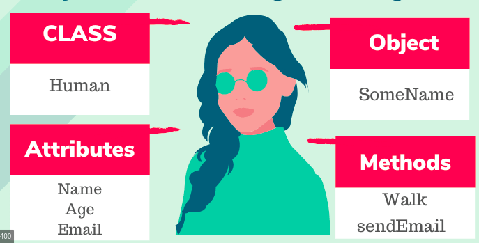
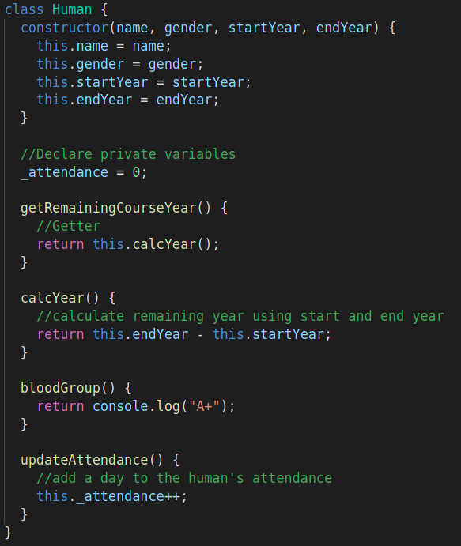

# Object Oriented Programming

## What is OOP?

Object Oriented Programming (OOP) is a programming model or pattern that depends on the idea of
classes and objects. Generally, it is used to design a software program into simple, reusable pieces of code which is usaualy called classes (blueprints). Classes is used to create individual instances of objects. Python, JavaScript, C++ and Java are the example of object oriented programming language.

## Benefits of using OOP

1. OOP models complex things as reproducible, simple structures
2. Reusable, OOP objects can be used across programs
3. Allows for class-specific behavior through polymorphism
4. Easier to debug, classes often contain all applicable information to them
5. Secure, protects information through encapsulation

## Which two programming paradigms are the most popular ones ?

OOP is the newer approach then Procedural programming. Example of procedural programming language is C, Pascal and Cobol.

| Procedural Oriented Programming                       | Object Oriented Programming                            |
| ----------------------------------------------------- | ------------------------------------------------------ |
| Program is divided into small parts called functions. | Program is divided into small parts called objects.    |
| It follows Top Down Approach                          | It follows Bottom Up Approach                          |
| Do not have any Access Specifier                      | Private, Public and Protected are the Access Specifier |
| It's not easy to add new data and function            | It's easy to add new data and function                 |
| Less secure because there is no way to hide data      | More secure because there is way to hide data          |
| Overloading is not allow                              | Overloading is allow                                   |
| Function is more important than data                  | Data is more important than function                   |
| It is based on unreal world                           | It is based on real world                              |

## Building blocks of OOP

- ### Classes

Classes is a blueprint for the structure of methods and attributes. Individual objects are created
from this blueprint. Classes include fields for attributes and methods(function) for behaviours.
In this example, Human is the class which include name and gender as a attribute while updateAttendance() and bloodGroup() are method.

<!--  -->
 

## References

<https://www.educative.io/blog/object-oriented-programming>

<https://www.educative.io/blog/how-to-use-oop-in-python>

<https://www.programiz.com/python-programming/object-oriented-programming>
