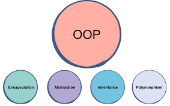

# Object Oriented Programming

## What is OOP?

Object Oriented Programming (OOP) is a programming model or pattern that depends on the idea of
classes and objects. Generally, it is used to design a software program into simple, reusable pieces of code which is usaualy called classes (blueprints). Classes is used to create individual instances of objects. Python, JavaScript, C++ and Java are the example of object oriented programming language.

## Benefits of using OOP

1. OOP models complex things as reproducible, simple structures
2. Reusable, OOP objects can be used across programs
3. Allows for class-specific behavior through polymorphism
4. Easier to debug, classes often contain all applicable information to them
5. Secure, protects information through encapsulation

## Which two programming paradigms are the most popular ones ?

OOP is the newer approach then Procedural programming. Example of procedural programming language is C, Pascal and Cobol.

| Procedural Oriented Programming                       | Object Oriented Programming                            |
| ----------------------------------------------------- | ------------------------------------------------------ |
| Program is divided into small parts called functions. | Program is divided into small parts called objects.    |
| It follows Top Down Approach                          | It follows Bottom Up Approach                          |
| Do not have any Access Specifier                      | Private, Public and Protected are the Access Specifier |
| It's not easy to add new data and function            | It's easy to add new data and function                 |
| Less secure because there is no way to hide data      | More secure because there is way to hide data          |
| Overloading is not allow                              | Overloading is allow                                   |
| Function is more important than data                  | Data is more important than function                   |
| It is based on unreal world                           | It is based on real world                              |

## Building blocks of OOP


- ### Classes

Classes is a blueprint for the structure of methods and attributes. Individual objects are created
from this blueprint. Classes include fields for attributes and methods(function) for behaviours.
In this example, Human is the class which include name and gender as a attribute while updateAttendance() and bloodGroup() are method.

<!--  -->
<br>
<!-- <p align="center">
</p> -->

```javascript
class Human {
  constructor(name, gender, startYear, endYear) {
    this.name = name;
    this.gender = gender;
    this.startYear = startYear;
    this.endYear = endYear;
  }

  //Declare private variables
  _attendance = 0;

  getRemainingCourseYear() {
    //Getter
    return this.calcYear();
  }

  calcYear() {
    //calculate remaining year using start and end year
    return this.endYear - this.startYear;
  }

  bloodGroup() {
    return console.log("A+");
  }

  updateAttendance() {
    //add a day to the human's attendance
    this._attendance++;
  }
}
```

- ### Objects

Object are created from the instances of classes with a specific data. A number of object is created from a single class. Objects contains state and behaviours. State is actually a data, below in the code snippet names, gender and all other information where data can be stored about human where as behaviours are methods/functions which object can undertake.

```javascript
const Henna = new Human("Henna", "Female", "2016", "2019");

const Julie = new Human("Julie", "Female", "2019", "2022");
```

- ### Attributes
  Attributes is a place where data is stored when an object is instantiated from the class template.
  Attributes is always defined inside class template.

```javascript
 constructor(name, gender, startYear, endYear) {
    this.name = name;
    this.gender = gender;
    this.startYear = startYear;
    this.endYear = endYear;
  }
```

- ### Methods
  Methods represent the behaviour of an object. Methods usually uses to perform action, return information about object as well as update object's information. In the code below, updateAttendance() and calYear() is the example of method.

```javascript
 bloodGroup() {
    return console.log("A+");
  }

  updateAttendance() {
    //add a day to the human's attendance
    this._attendance++;
  }
```

## Four Pillars of OOP

<br>
<p align="center">
</p>

<br>

## Inheritance

Inheritance allows a new classes to access all the properties and behaviours from other classes. Classes which share the properties and behaviour is called parent, base or super class where as the child classes called derived or extended class. Inheritance is uses to eliminate redundant code.

In the following code snippet, child class olympianStudent inherits the method bloodGroup() from the parent class Human, and the child class adds an additional method, award().

```javascript
class Human {
  constructor(name, gender, startYear, endYear) {
    this.name = name;
    this.gender = gender;
    this.startYear = startYear;
    this.endYear = endYear;
  }

  //Declare private variables
  _attendance = 0;

  getRemainingCourseYear() {
    //Getter
    return this.calcYear();
  }

  calcYear() {
    //calculate remaining year using start and end year
    return this.endYear - this.startYear;
  }

  bloodGroup() {
    return console.log("A+");
  }

  updateAttendance() {
    //add a day to the human's attendance
    this._attendance++;
  }
}

//Child class olympianStudent, inherits from parent Human
class olympianStudent extends Human {
  constructor(name, gender, startYear, endYear) {
    super(name);
    super(gender);
    super(startYear);
    super(endYear);
  }

  award() {
    //additional method for olympianStudent child class
    return console.log("Gold medal");
  }
}

//instantiate a new olympianStudent object
const Shila = new olympianStudent(
  "Fluffy",
  "Female",
  01 / 02 / 2021,
  01 / 08 / 2021
);

Shila.award();
```

## Encapsulation

Encapsulation is the idea that the data of an object should not be accessed directly. Instead
of using a proper way to call a method.

- ### Problem

```javascript
var student = {
  fullName: "JOHN",
};

alert(student.fullName); // JOHN
student.fullName = "Jimmy";
alert(student.fullName); // Jimmy
```

In this code, user can easily change the fullname without any hesitation but if someone misuse
this and input a numerical value instead of string.

```javascript
student.fullName = 20;
alert(student.fullName); // 20
```

- ### Continue with the problem 1 by providing data validation

```javascript
var student = {
  fullName: "Jason Shapiro",
  setFullName: function (newValue) {
    var reg = new RegExp(/\d+/);
    if (reg.test(newValue)) {
      alert("Invalid Name");
    } else {
      this.fullName = newValue;
    }
  },
  getFullName: function () {
    return this.fullName;
  },
};

alert(student.getFullName()); // Jason Shapiro
student.setFullName("Jim White");
alert(student.getFullName()); // Jim White
student.setFullName(42); // Invalid Name
alert(student.getFullName()); // Jim White
```

Now data validation is working but if someone directly access student.fullname

```javascript
student.fullName = 42; // No validation is executed; the name is changed and...
alert(student.getFullName()); // ...42 is printed.
```

So to make fullname private and give access to all the variable which is inside the function
getFullName() and setFullName() can be done using closures. A closure gives access to an outer function’s scope from an inner function.

- ### Solution

```javascript
var student = (function () {
  var fullName = "Jason Shapiro";
  var reg = new RegExp(/\d+/);

  return {
    setFullName: function (newValue) {
      if (reg.test(newValue)) {
        alert("Invalid Name");
      } else {
        fullName = newValue;
      }
    },
    getFullName: function () {
      return fullName;
    },
  }; // end of the return
})();

alert(student.getFullName()); // Jason Shapiro
student.setFullName("Jim White");
alert(student.getFullName()); // Jim White
student.setFullName(42); // Invalid Name; the name is not changed.
student.fullName = 42; // Doesn't affect the private fullName variable.
alert(student.getFullName()); // Jim White is printed again.
```

## Abstraction

## Polymorphism

## References

<https://www.educative.io/blog/object-oriented-programming>

<https://www.educative.io/blog/how-to-use-oop-in-python>

<https://www.programiz.com/python-programming/object-oriented-programming>

<https://www.intertech.com/encapsulation-in-javascript/>
